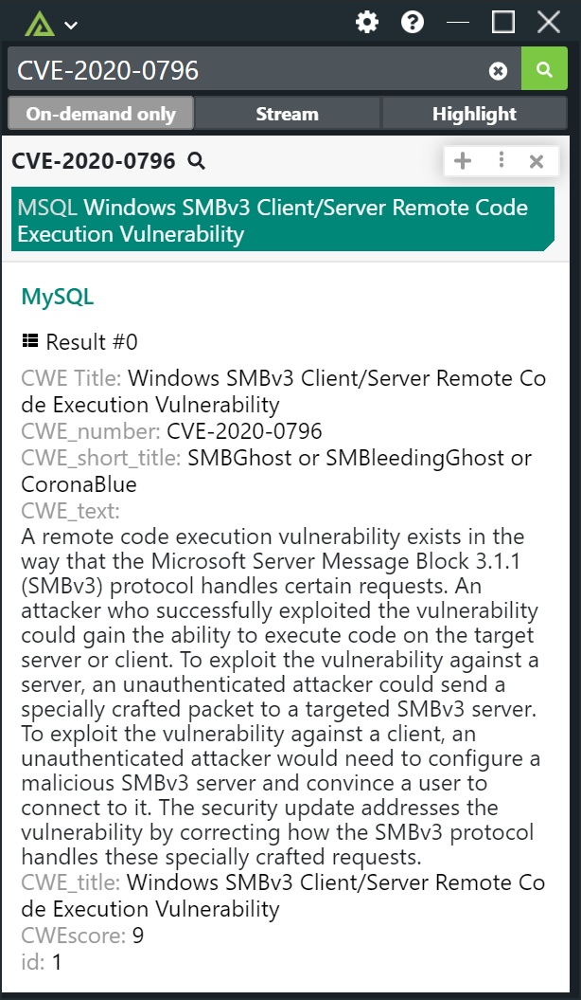

# Polarity MySQL/MariaDB Integration


Polarity's MySQL/MariaDB integration allows automated lookups to a MySQL or MariaDB database using a user defined query.  The integration only supports running a single query.  As a result, it is recommended to pick a single entity type using the "Manage Integration Data" option on the integrations page.

This integration uses the excellent [node-mariadb](https://www.npmjs.com/package/mariadb).  While this integration will work out of the box, it primarily intended to provide a well-defined template for constructing your own custom MySQL/MariaDB based integrations.

> Please note that this integration is designed to work with a single database user account.  As a result you should make sure the database connection options (host, port, name, user, and password) are locked (i.e., all users share the same settings)

|  |
|---|
|*SELECT *, CWE_title as 'CWE Title', CWE_title as tag FROM cwe_list WHERE CWE_number=? LIMIT 5* | 

## MySQL Integration Options

#### Database Host

The hostname or IP of the server running the MySQL database you wish to connect to.  Note that you will likely need to make modifications to your pg_hba.conf file to allow the connection to be made.

#### Database Port

The port your database is running on.  Defaults to 3306.

#### Database Name

The name of the database you are connecting to.

#### User

The user you want the integration to connect to your postgres database as.  We recommend creating a read-only user for this purpose.

#### Password

The database password for the provided user above.

#### Query

The query you want to execute and return data for.

As this integration only supports running a single query for any registered entity types, you will likely want to send only a single entity type to the query using the "Manage Integration Data" option on the integrations page. When constructing your query you can substitute the entity value into the query using the special string `$1`.

For example, if you set the integration to only receive IPv4 addresses then you can set the Query option to the following:

```MySQL
 SELECT * FROM data WHERE ip = ?
```

In the above example `?` will be replaced with the actual entity value using MySQL's built-in query parameterization to prevent SQL injection.  If the IP address `127.0.0.1` is on your screen then the above query will become:

```MySQL
SELECT * FROM data WHERE ip = '127.0.0.1'
```

You can also automatically set return columns to be treated as tags by naming the column with a string that starts with "tag".  For example:

```MySQL
SELECT hostname as tag1, location as tag2 WHERE ip = ?
```

In the above example, the value of hostname and location will be set as tags in the Polarity Overlay window.  Any other returned columns will be displayed as details in the overlay window details block when clicking on the entity and expanding it.  The default display is a table.

> Return columns that have been renamed as "tags" will not be shown in the details block.

You can rename columns to provide more readable data in the details block.

```MySQL
SELECT cwe as 'CWE Title', score as 'CWE Score' FROM vuln_listing WHERE cwe = ? LIMIT 10;
```

For queries that can return a large number of results, don't forget to limit the number of return rows.

## Installation Instructions

Installation instructions for integrations are provided on the [PolarityIO GitHub Page](https://polarityio.github.io/).

## Polarity

Polarity is a memory-augmentation platform that improves and accelerates analyst decision making.  For more information about the Polarity platform please see:

https://polarity.io/